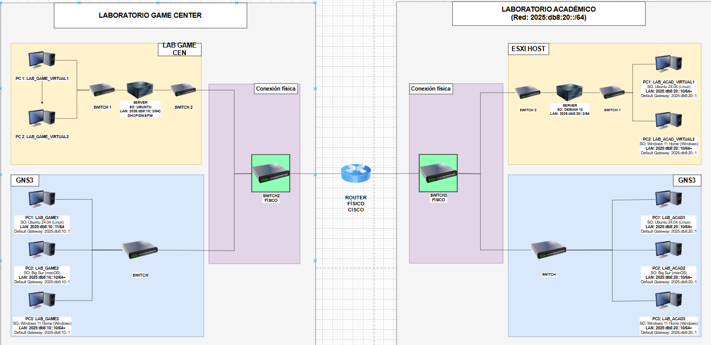

# Informe Técnico de Propuesta de Sistema Operativo para un Laboratorio Académico y un Game Center

**FACULTAD DE INGENIERÍA Y ARQUITECTURA**  
**ESCUELA PROFESIONAL DE INGENIERÍA DE SISTEMAS**

---

## 📋 Información del Proyecto

**Curso:** Sistemas Operativos  
**Profesor:** Villegas Alex  
**Año:** 2025  
**Ubicación:** Lima, Perú

### 👥 Autores

- **Quispe Chumbes Boris Santiago**
- **Zúñiga Medina José Darío**

---

## 📖 Índice

1. [Descripción del Proyecto](#descripción-del-proyecto)
2. [Topología de Red](#topología-de-red)
3. [Arquitectura del Sistema](#arquitectura-del-sistema)
4. [Servicios Implementados](#servicios-implementados)
5. [Gestión de Procesos y Servicios](#gestión-de-procesos-y-servicios)
6. [Administración de Usuarios y Permisos](#administración-de-usuarios-y-permisos)
7. [Automatización de Tareas](#automatización-de-tareas)
8. [Seguridad y Políticas](#seguridad-y-políticas)
9. [Mantenimiento y Monitoreo](#mantenimiento-y-monitoreo)
10. [Guía de Uso](#guía-de-uso)

---

## 🎯 Descripción del Proyecto

Este proyecto implementa una infraestructura completa de red IPv6 para un laboratorio académico y game center, utilizando tecnologías de virtualización y automatización con Ansible.

### Objetivos

- ✅ Implementar una red IPv6 pura (`2025:db8:10::/64`)
- ✅ Configurar servicios de red esenciales (DNS, DHCP, Web)
- ✅ Automatizar el despliegue con Ansible
- ✅ Gestionar múltiples sistemas operativos (Linux, Windows, macOS)
- ✅ Implementar seguridad con firewall y fail2ban

---

## 🌐 Topología de Red

### Servidor Gaming 1
- **Servidor Ubuntu** (Principal)
  - IP: `2025:db8:10::2`
  - Servicios: DNS (BIND9), DHCPv6, Nginx, Firewall
- **Estaciones:**
  - macOS
  - Linux
  - Windows 11

### Servidor Gaming 2
- **Servidor Debian**
  - Servicios: Secundario/Backup
- **Estaciones:**
  - macOS
  - Linux
  - Windows 11

### Diagrama de Red

```
                    Internet (NAT)
                          |
                    [VMware ESXi]
                          |
        +-----------------+------------------+
        |                                    |
   [Servidor 1]                        [Servidor 2]
   Ubuntu Server                       Debian Server
   2025:db8:10::2                     2025:db8:10::3
        |                                    |
   +----+----+                          +----+----+
   |    |    |                          |    |    |
  Mac Linux Win                        Mac Linux Win
```

---

## 🏗️ Arquitectura del Sistema

### Justificación de Sistemas Operativos

| Sistema Operativo | Uso | Justificación |
|-------------------|-----|---------------|
| **Ubuntu Server 24.04 LTS** | Servidor principal | • Soporte LTS de 5 años<br>• Amplia documentación y comunidad<br>• Excelente compatibilidad con Ansible<br>• Repositorios actualizados<br>• Ideal para servicios de red (DNS, DHCP, Web) |
| **Debian** | Servidor secundario | • Máxima estabilidad<br>• Menor consumo de recursos<br>• Base sólida para servidores de producción<br>• Compatible con paquetes Ubuntu |
| **Ubuntu Desktop** | Estaciones de trabajo | • Interfaz amigable para usuarios<br>• Compatibilidad con software académico<br>• Fácil gestión remota<br>• Soporte de hardware moderno |
| **Windows 11** | Estaciones gaming | • Compatibilidad con juegos<br>• Software específico de Windows<br>• Familiaridad para usuarios finales |
| **macOS** | Estaciones especializadas | • Desarrollo iOS/macOS<br>• Software de diseño profesional<br>• Ecosistema Apple |

### Tecnologías Utilizadas

| Componente | Tecnología | Versión |
|------------|-----------|---------|
| Virtualización | VMware ESXi | 7.0+ |
| Automatización | Ansible | 2.15+ |
| Servidor DNS | BIND9 | 9.18+ |
| Servidor DHCP | isc-dhcp-server | 4.4+ |
| Servidor Web | Nginx | 1.24+ |
| Firewall | UFW + fail2ban | - |
| Sistema Base | Ubuntu Server | 24.04 LTS |

### Estructura del Proyecto

```
ansible-gestion-despliegue/
├── roles/
│   ├── common/          # Configuración base
│   ├── network/         # Red IPv6 y radvd
│   ├── dns_bind/        # Servidor DNS
│   ├── dhcpv6/          # Servidor DHCPv6
│   ├── http_web/        # Servidor web Nginx
│   ├── firewall/        # UFW y fail2ban
│   └── storage/         # Gestión de almacenamiento
├── playbooks/           # Playbooks de Ansible
├── scripts/
│   ├── run/            # Scripts de ejecución
│   ├── diagnostics/    # Scripts de diagnóstico
│   └── setup/          # Scripts de instalación
├── inventory/          # Inventario de hosts
└── group_vars/         # Variables de configuración
```

---

## 🔧 Servicios Implementados

### 1. DNS (BIND9)

El servidor DNS permite acceder a los servicios por nombre en lugar de recordar IPs.

- **Dominio:** `gamecenter.local` - Nombre de dominio local para la red interna
- **Zona directa:** Convierte nombres (ej: `www.gamecenter.local`) en direcciones IP (`2025:db8:10::2`)
- **Zona inversa:** Convierte direcciones IP en nombres (resolución inversa para logs y seguridad)

**Registros DNS configurados:**

| Nombre | Tipo | Destino | Descripción |
|--------|------|---------|-------------|
| `gamecenter.local` | AAAA | `2025:db8:10::2` | Dominio raíz |
| `servidor.gamecenter.local` | AAAA | `2025:db8:10::2` | Servidor principal |
| `www.gamecenter.local` | CNAME | `servidor` | Alias para web |
| `web.gamecenter.local` | CNAME | `servidor` | Alias alternativo |
| `dns.gamecenter.local` | CNAME | `servidor` | Alias para DNS |

**¿Cómo funciona?**
- Cuando escribes `http://gamecenter.local` en el navegador, el DNS lo traduce a `2025:db8:10::2`
- Los CNAME son alias: `www.gamecenter.local` apunta a `servidor.gamecenter.local`
- Esto permite cambiar la IP del servidor sin actualizar todos los registros

### 2. DHCPv6
- **Rango de IPs:** `2025:db8:10::10` - `2025:db8:10::FFFF`
- **Asignación dinámica** con DUID
- **Configuración automática** de DNS y dominio
- **SLAAC desactivado** para control centralizado

### 3. Servidor Web (Nginx)
- **Puerto:** 80 (HTTP)
- **Página de bienvenida** personalizada
- **Acceso por nombre:** `http://gamecenter.local`
- **Headers de seguridad** configurados

### 4. Firewall y Seguridad
- **UFW:** Firewall con reglas específicas
- **fail2ban:** Protección contra ataques de fuerza bruta
- **Puertos abiertos:**
  - 22/tcp (SSH con rate limiting)
  - 53/tcp+udp (DNS)
  - 80/tcp (HTTP)
  - 546-547/udp (DHCPv6)

---

## 📊 Gestión de Procesos y Servicios

### Linux (Servidor Ubuntu/Debian)

#### Herramientas Clave
- `top`, `htop` - Monitoreo en tiempo real
- `ps aux` - Lista de procesos
- `systemctl` - Gestión de servicios
- `journalctl` - Logs del sistema
- `ss`, `netstat` - Puertos y conexiones

#### Comandos Esenciales

```bash
# Monitorización
top                                    # Ver CPU/RAM
ps aux --sort=-%cpu | head -n 20      # Top procesos por CPU
ps aux --sort=-%mem | head -n 20      # Top procesos por memoria

# Gestión de servicios
systemctl status nombre_servicio       # Ver estado
sudo systemctl restart nombre_servicio # Reiniciar
sudo systemctl enable nombre_servicio  # Habilitar al inicio
sudo systemctl disable nombre_servicio # Deshabilitar

# Logs
sudo journalctl -u nombre_servicio --since "2 hours ago"
sudo journalctl -p err -b             # Errores del boot actual
sudo journalctl -f                    # Seguir logs en tiempo real

# Puertos y conexiones
ss -tulnp                             # Ver puertos abiertos
sudo ss -tulnp | grep :80             # Ver quién usa puerto 80
```

#### Ejemplo: Reiniciar Nginx

```bash
sudo systemctl restart nginx
sudo systemctl status nginx --no-pager
sudo journalctl -u nginx -n 50
```

#### Comportamiento ante Cuelgue de Servicio

1. Ver estado: `systemctl status servicio`
2. Revisar logs: `journalctl -u servicio -n 200`
3. Reiniciar: `sudo systemctl restart servicio`
4. Si persiste: `sudo reboot` (con aviso previo)

### Windows 11 (Estaciones)

#### Herramientas Clave
- Administrador de tareas (Task Manager) - `Ctrl+Shift+Esc`
- `services.msc` - Gestión de servicios GUI
- `eventvwr.msc` - Visor de eventos
- `tasklist` - Lista de procesos desde CMD

> **Nota:** La gestión de Windows se realiza principalmente mediante interfaz gráfica en este proyecto.

---

## 👤 Administración de Usuarios y Permisos

### Principios y Convenciones

- **Nombres de cuenta:** `rol_area_num` (ej: `alumno_redes_01`, `tec_soporte_01`)
- **No usar cuentas admin** para tareas diarias
- **Roles definidos:**
  - Estudiante/Jugador
  - Staff/Técnico
  - Administrador

### Linux - Gestión de Usuarios

```bash
# Crear grupo
sudo groupadd alumnos

# Crear usuario
sudo useradd -m -s /bin/bash -G alumnos nombre_usuario
sudo passwd nombre_usuario

# Cambiar propietario y permisos
sudo chown usuario:grupo /ruta/recurso
sudo chmod 750 /ruta/recurso

# ACLs (permisos avanzados)
sudo setfacl -m u:usuario:rwx /ruta/carpeta
getfacl /ruta/carpeta
```

#### Ejemplo Completo

```bash
# Crear usuario para jugador
sudo groupadd jugadores
sudo useradd -m -s /bin/bash -G jugadores pepe
sudo passwd pepe

# Crear directorio personal
sudo mkdir -p /srv/games/pepe
sudo chown pepe:jugadores /srv/games/pepe
sudo chmod 750 /srv/games/pepe
```

### Compartir Recursos (Samba)

#### Configuración en `/etc/samba/smb.conf`

```ini
[games]
    path = /srv/games
    browseable = yes
    read only = no
    valid users = @jugadores
    create mask = 0750
    directory mask = 0750
```

#### Agregar Usuario Samba

```bash
sudo smbpasswd -a pepe
```

#### Conectar desde Windows

```cmd
net use Z: \\192.168.1.10\games /user:pepe contraseña
```

---

## ⚙️ Automatización de Tareas

### Linux - Cron

#### Editar Crontab

```bash
crontab -e          # Usuario actual
sudo crontab -e     # Root
```

#### Ejemplos de Tareas

```cron
# Limpiar /tmp cada día a las 02:00
0 2 * * * /usr/bin/find /tmp -mindepth 1 -mtime +1 -delete

# Backup diario a las 03:00
0 3 * * * /usr/local/bin/backup_rsync.sh

# Actualizar sistema semanalmente (domingos 04:00)
0 4 * * 0 /usr/bin/apt update && /usr/bin/apt -y upgrade >> /var/log/apt-upgrade.log 2>&1
```

#### Script de Backup (`/usr/local/bin/backup_rsync.sh`)

```bash
#!/bin/bash
SRC="/srv/data/"
DEST="/mnt/backup/data/"
LOG="/var/log/backup_rsync.log"

rsync -a --delete --exclude='tmp/' $SRC $DEST >> $LOG 2>&1
```

```bash
sudo chmod +x /usr/local/bin/backup_rsync.sh
```

### Windows - Task Scheduler

#### Script de Limpieza (`limpieza.bat`)

```batch
@echo off
del /q /f C:\Windows\Temp\*
del /q /f %temp%\*
echo Limpieza completada >> C:\logs\limpieza.log
```

#### PowerShell Backup (`C:\scripts\backup.ps1`)

```powershell
$source = "C:\Users\Public\Documents"
$dest = "\\192.168.1.10\backup\PC01"

New-Item -ItemType Directory -Path $dest -Force
robocopy $source $dest /MIR /FFT /R:3 /W:5 /LOG:C:\scripts\logs\robocopy-PC01.log
```

---

## 🔒 Seguridad y Políticas

> ⚠️ **Nota:** Las políticas de seguridad avanzadas están siendo implementadas en fases posteriores del proyecto. Actualmente se encuentran en desarrollo las siguientes medidas:
> - Políticas de contraseñas robustas
> - Actualizaciones automáticas programadas
> - Configuración avanzada de firewall
> - Auditoría y logging centralizado

### Contraseñas (En implementación)

- **Longitud mínima:** 12 caracteres
- **Complejidad:** Mayúsculas, minúsculas, números y símbolos
- **Cambio:** Cada 90 días para administradores
- **Prohibido:** Cuentas compartidas

### Actualizaciones

#### Linux

```bash
# Actualización manual
sudo apt update && sudo apt upgrade -y

# Actualización automática (cron semanal)
0 4 * * 0 /usr/bin/apt update && /usr/bin/apt -y upgrade >> /var/log/apt-upgrade.log 2>&1
```

#### Windows

- Programar Windows Update fuera de horario pico
- Mejor control manual en game centers
- Actualizaciones en madrugada

### Firewall

#### Linux (UFW)

```bash
# Habilitar UFW
sudo ufw enable

# Reglas básicas
sudo ufw allow from 192.168.1.0/24 to any port 22 proto tcp
sudo ufw allow 53/tcp
sudo ufw allow 53/udp
sudo ufw allow 80/tcp
sudo ufw allow 139,445/tcp  # Samba

# Ver estado
sudo ufw status verbose
```

#### Windows

- Configurar reglas en Windows Defender Firewall
- Permitir solo puertos necesarios
- Bloquear tráfico entrante por defecto

### Antivirus

> **Nota:** En este proyecto no se implementa antivirus adicional. Se utilizan las herramientas de seguridad nativas:
> - **Windows:** Windows Defender (incluido en Windows 11)
> - **Linux:** Seguridad mediante firewall (UFW) y fail2ban
> - **Actualizaciones regulares** del sistema como medida preventiva principal

---

## 🔧 Mantenimiento y Monitoreo

### Checklist Diario

- [ ] Verificar estado del servidor (`top`, `df -h`)
- [ ] Revisar logs de errores (`journalctl -p err -n 100`)
- [ ] Comprobar backups diarios
- [ ] Verificar disponibilidad de servicios
- [ ] Revisar tickets/incidencias

### Checklist Semanal

- [ ] Aplicar actualizaciones de seguridad
- [ ] Escaneo antivirus completo
- [ ] Limpieza de logs grandes
- [ ] Probar restauración de archivos desde backup
- [ ] Revisar uso de disco

### Checklist Mensual

- [ ] Revisión de cuentas inactivas
- [ ] Limpieza profunda de discos
- [ ] Pruebas de rendimiento
- [ ] Revisión de permisos

### Checklist Trimestral

- [ ] Prueba completa de restauración desde backup
- [ ] Revisión de políticas de contraseñas
- [ ] Inventario de hardware
- [ ] Revisión física de equipos

---

## 📚 Guía de Uso

> 📋 **Nota:** Las pruebas detalladas y evidencias de funcionamiento se encuentran en el archivo [PRUEBAS.md](docs/PRUEBAS.md)

> ⚠️ **Estado del proyecto:** La automatización con Ansible está en desarrollo activo. Algunos servicios requieren configuración manual adicional.

### Repositorio del Proyecto

🔗 **GitHub:** [https://github.com/kyrafka/ansible](https://github.com/kyrafka/ansible)

### Instalación Inicial

```bash
# 1. Clonar repositorio
git clone https://github.com/kyrafka/ansible.git
cd ansible

# 2. Configurar entorno Ansible
bash scripts/setup/setup-ansible-env.sh --auto

# 3. Activar entorno virtual
source activate-ansible.sh
```

#### ¿Qué es el entorno virtual de Ansible?

El **entorno virtual** (`~/.ansible-venv/`) es un ambiente aislado de Python que contiene:

- ✅ **Ansible** y todas sus dependencias
- ✅ **Colecciones** necesarias (community.vmware, community.general, etc.)
- ✅ **Librerías Python** (pyvmomi, requests, jinja2)
- ✅ **Versiones específicas** sin conflictos con el sistema

**¿Por qué usarlo?**
- 🔒 **Aislamiento:** No afecta al Python del sistema
- 🎯 **Reproducibilidad:** Mismas versiones en todos los entornos
- 🧹 **Limpieza:** Fácil de eliminar sin dejar rastros
- 🚀 **Portabilidad:** Funciona igual en cualquier máquina

**Activación:**
```bash
source activate-ansible.sh  # Activa el entorno
# Ahora puedes usar ansible-playbook, ansible, etc.
```

### Configuración y Ejecución

```bash
# 4. Configurar inventario
nano inventory/hosts.ini

# 5. Ejecutar playbook completo
ansible-playbook site.yml
```

### Scripts Disponibles

El proyecto utiliza scripts bash para facilitar la ejecución y validación de servicios.

#### 🚀 Scripts de Ejecución (`scripts/run/`)

| Script | Descripción | Uso |
|--------|-------------|-----|
| `run-network.sh` | Configura red IPv6, radvd, NAT66 | `bash scripts/run/run-network.sh` |
| `run-dns.sh` | Instala y configura BIND9 | `bash scripts/run/run-dns.sh` |
| `run-dhcp.sh` | Configura servidor DHCPv6 | `bash scripts/run/run-dhcp.sh` |
| `run-web.sh` | Instala Nginx y configura sitio web | `bash scripts/run/run-web.sh` |
| `run-firewall.sh` | Configura UFW y fail2ban | `bash scripts/run/run-firewall.sh` |
| `run-all-services.sh` | Ejecuta todos los servicios en orden | `bash scripts/run/run-all-services.sh` |

#### ✅ Scripts de Validación (`scripts/run/`)

| Script | Descripción | Uso |
|--------|-------------|-----|
| `validate-network.sh` | Valida configuración de red IPv6 | `bash scripts/run/validate-network.sh` |
| `validate-dns.sh` | Valida servidor DNS y resolución | `bash scripts/run/validate-dns.sh` |
| `validate-dhcp.sh` | Valida servidor DHCPv6 | `bash scripts/run/validate-dhcp.sh` |
| `validate-web.sh` | Valida servidor web Nginx | `bash scripts/run/validate-web.sh` |
| `validate-firewall.sh` | Valida reglas de firewall | `bash scripts/run/validate-firewall.sh` |

#### 🔬 Scripts de Diagnóstico (`scripts/diagnostics/`)

| Script | Descripción | Uso |
|--------|-------------|-----|
| `diagnose-dns.sh` | Diagnóstico avanzado de DNS con análisis | `bash scripts/diagnostics/diagnose-dns.sh` |
| `test-dns-records.sh` | Prueba todos los registros DNS | `bash scripts/diagnostics/test-dns-records.sh` |

#### ⚙️ Scripts de Configuración (`scripts/setup/`)

| Script | Descripción | Uso |
|--------|-------------|-----|
| `setup-ansible-env.sh` | Instala Ansible y dependencias | `bash scripts/setup/setup-ansible-env.sh --auto` |

### Playbooks Disponibles

#### 📦 Playbooks Principales (`playbooks/`)

| Playbook | Descripción | Uso |
|----------|-------------|-----|
| `site.yml` | Playbook principal - ejecuta todos los roles | `ansible-playbook site.yml` |
| `create_ubpc.yml` | Crea y configura VM UBPC completa | `ansible-playbook playbooks/create_ubpc.yml` |
| `create-ubuntu-desktop.yml` | Crea VM Ubuntu Desktop | `ansible-playbook playbooks/create-ubuntu-desktop.yml` |

#### 🎯 Ejecución por Tags

```bash
# Ejecutar solo un servicio específico
ansible-playbook site.yml --tags network   # Solo red
ansible-playbook site.yml --tags dns       # Solo DNS
ansible-playbook site.yml --tags dhcp      # Solo DHCP
ansible-playbook site.yml --tags web       # Solo Nginx
ansible-playbook site.yml --tags firewall  # Solo firewall
```

---

## 📸 Evidencias y Capturas de Pantalla

> 📁 **Ubicación de imágenes:** `docs/images/`  
> 📋 **Lista completa de imágenes requeridas:** Ver [IMAGENES-REQUERIDAS.md](docs/IMAGENES-REQUERIDAS.md)

### Topología de Red


*Diagrama completo de la infraestructura de red*


*Servidor Gaming 1 - Ubuntu Server + VMs*


*Servidor Gaming 2 - Debian Server + VMs*


*Esquema de direccionamiento IPv6*

### Configuración del Sistema


*Estructura de carpetas del proyecto Ansible*


*Configuración de red del servidor (netplan)*

### Servicios en Funcionamiento


*Archivo de zona DNS (db.gamecenter.local)*


*Página web accesible desde http://gamecenter.local*


*Reglas de firewall configuradas*

### Pruebas de Funcionamiento


*Prueba de resolución DNS con dig*


*IP asignada por DHCPv6 al cliente*


*Acceso exitoso a http://gamecenter.local*

### Monitoreo y Diagnóstico


*Monitoreo de recursos del servidor con htop*


*Logs del sistema con journalctl*

---

## 📝 Notas Adicionales

### Procedimiento ante Incidentes

1. **Descripción:** Recoger reporte (quién, qué, cuándo)
2. **Impacto:** ¿Afecta a todos o solo a una máquina?
3. **Contención:** Aislar máquina/red si es necesario
4. **Diagnóstico:** Revisar logs, procesos, recursos
5. **Mitigación:** Reinicio, restaurar backup, aplicar parche
6. **Recuperación:** Volver a servicio normal
7. **Postmortem:** Documentar causa raíz y prevención

### Template de Reporte de Incidente

```
Fecha/hora: 
Reportado por: 
Afectados: 
Síntomas: 
Acciones tomadas: 
Resultado: 
Recomendaciones: 
```

---

## 🔗 Referencias

- [Documentación de Ansible](https://docs.ansible.com/)
- [BIND9 Documentation](https://bind9.readthedocs.io/)
- [Nginx Documentation](https://nginx.org/en/docs/)
- [Ubuntu Server Guide](https://ubuntu.com/server/docs)

---

## 📄 Licencia

Este proyecto es parte de un trabajo académico para el curso de Sistemas Operativos.

---

**Última actualización:** Noviembre 2025
